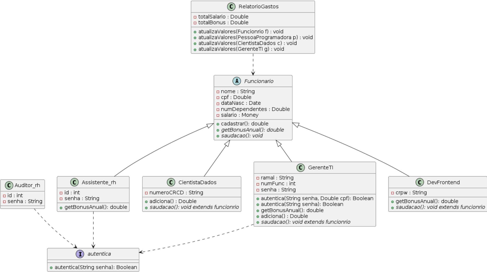

Descrição do Projeto

Este projeto tem como objetivo desenvolver um sistema de gerenciamento de funcionários utilizando Java, com uma estrutura modular e bem definida através de um diagrama de classes. O sistema é projetado para ser escalável, permitindo fácil manutenção e expansão conforme as necessidades da organização evoluem. A seguir, são descritas as principais classes e suas responsabilidades dentro do sistema:

O projeto abrange diferentes tipos de funcionários, cada um com suas características e funcionalidades específicas. A classe base Funcionario define os atributos e métodos comuns a todos os funcionários, enquanto classes especializadas, como GerenteTI, CientistaDados e DevFrontend, herdam de Funcionario e adicionam funcionalidades específicas de suas respectivas funções.

